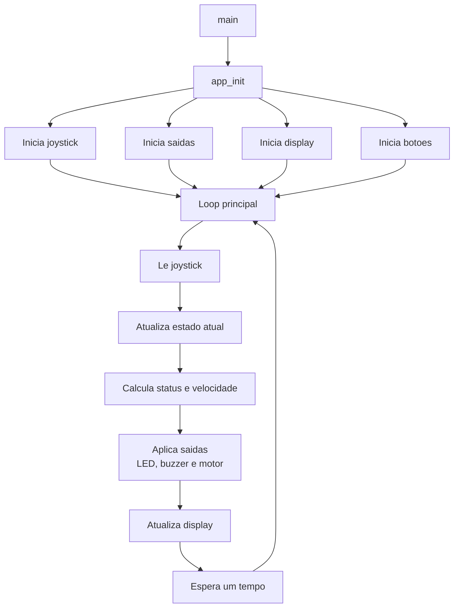

`O projeto utiliza a Raspberry Pi Pico W para monitorar temperatura e controlar a velocidade de um motor via joystick. O sistema classifica estados (Normal, Atencao e Critico), aciona LED RGB e buzzer, e exibe dados em um display OLED com modos manual e automatico.`

## Mapeamento de hardware usado

- LED RGB: `GPIO13` vermelho, `GPIO12` azul, `GPIO11` verde
- OLED SSD1306 I2C: `GPIO14` SDA, `GPIO15` SCL
- Botao manual: `GPIO5`
- Botao automatico: `GPIO6`
- Saida PWM do motor: `GPIO4`
- Buzzer onboard: `GPIO21`
- Joystick: `Y GPIO26/ADC0`, `X GPIO27/ADC1`, `SW GPIO22`

---

- Eixo Y do joystick: temperatura de `0 a 100 C`
- Eixo X do joystick: velocidade manual do motor de `0 a 100 %`
- Faixas de temperatura:
  - `< 70 C`: `NORMAL`
  - `70 a 87 C`: `ATENCAO`
  - `> 87 C`: `CRITICO`
- Modo `MANUAL`: velocidade vem do eixo X
- Modo `AUTO`: velocidade e definida pela temperatura
  - `NORMAL`: `35 %`
  - `ATENCAO`: `65 %`
  - `CRITICO`: `100 %`
- Buzzer:
  - `NORMAL`: desligado
  - `ATENCAO`: beep curto periodico
  - `CRITICO`: beep rapido continuo
- Interface local no display OLED:
  - exibicao de temperatura
  - exibicao de velocidade
  - exibicao de status
  - exibicao do modo de operacao

## Estrutura do firmware RP2040

- `src/app.c`: orquestra o loop principal e as interrupcoes
- `src/joystick.c`: leitura ADC e conversao
- `src/status.c`: classificacao e regras de controle automatico
- `src/outputs.c`: LED RGB, PWM do motor e buzzer
- `src/display.c`: composicao da tela OLED
- `src/ssd1306.c`: driver basico do display

## Como usar

1. Grave o firmware na `BITDOGLAB`, conecte o cabo micro USB na sua `BITDOGLAB` e, antes de conectar ao computador, segure o botao `BOOTSEL` atras da placa. Depois disso, basta compilar e rodar o codigo.
2. Acompanhe o estado do sistema diretamente no display OLED.
3. Use os botoes fisicos para alternar entre `MANUAL` e `AUTO`.

## Fluxograma

